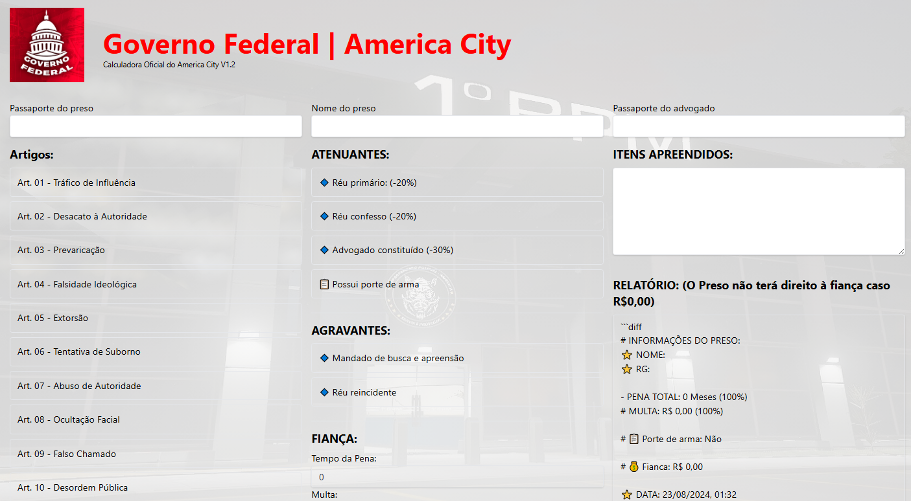

# Calculadora Penal America City

Olá, estou trazendo mais um dos meus projetos. Desenvolvemos este sistema para o servidor de FiveM America City com o objetivo de agilizar e otimizar o processo de prisão realizado pelos policiais no Roleplay. A intenção é reduzir o tempo gasto durante a prisão, permitindo que os jogadores policiais foquem mais na experiência do jogo e menos nos procedimentos repetitivos.

## 📷 Começando

https://calculadora-america.vercel.app/

|  Artigo | Tempo | Multa |
| ------------- | ------------- | ------------- |
Art. 01 - Tráfico de Influência	| 25 |	35k
Art. 02 - Desacato à Autoridade	| 45 |	40K
Art. 03 - Prevaricação	| 30 |	50K
Art. 04 - Falsidade Ideológica	| 20 |	60K
Art. 05 - Extorsão	| 15 |	25K
Art. 06 - Tentativa de Suborno	| 38 |	55K
Art. 07 - Abuso de Autoridade	| 45 |	90K
Art. 08 - Ocultação Facial	| 20 |	20K
Art. 09 - Falso Chamado	| 25 |	50K
Art. 10 - Desordem Pública	| 25 |	25K
Art. 11 - Tentativa de Homicídio	| 65 |	200K
Art. 12 - Homicídio Doloso	| 75 |	250K
Art. 13 - Homicídio Funcionário Público	| 80 |	40K
Art. 14 - Sequestro de Funcionário Público	| 35 |	40K
Art. 15 - Sequestro	| 35 |	40K
Art. 16 - Lesão Corporal	| 30 |	40K
Art. 17 - Furto	| 25 |	30K
Art. 18 - Receptação	| 25 |	45K
Art. 19 - Roubo de Veículo Oficial	| 40 |	90K
Art. 20 - Roubo à Caixa Registradora	| 35 |	45k
Art. 21 - Roubo à Conveniência	| 30 |	45K
Art. 22 - Assalto à Mão Armada	| 45 |	90K
Art. 23 - Porta Peças de Arma (Agravante)	| 15 |	30K
Art. 24 - Tráfico de Armas	| 45 |	100K
Art. 25 - Porte de Arma de Baixo Calibre	| 35 |	45K
Art. 26 - Porte de Arma de Médio Calibre	| 45 |	50K
Art. 27 - Porte de Arma de Alto Calibre	| 55 |	80K
Art. 28 - Posse de Munição	| 45 |	55K
Art. 29 - Equipamento Balístico	| 15 |	20K
Art. 30 - Associação ao Tráfico	| 30 |	60K
Art. 31 - Posse de Droga (-10)	| 35 |	35k
Art. 32 - Tráfico de Drogas (+10)	| 45 |	90K
Art. 33 - Atropelamento	| 10 |	50K
Art. 34 - Extorsão	| 30 |	45K
Art. 35 - Atropelamento	| 10 |	50K
Art. 36 - Corrida Ilegal	| 15 |	25K
Art. 37 - Tentativa de Fuga	| 45 |	50K
Art. 38 - Lavagem de Dinheiro	| 45 |	60K
Art. 39 - Formação de Quadrilha	| 45 |	100K
Art. 40 - QRR Ilegal	| 30 |	60K
Art. 41 - Chefe de Quadrilha	| 200 |	250K

### 📋 Créditos

https://github.com/revoada-rj/calculadora-penal

